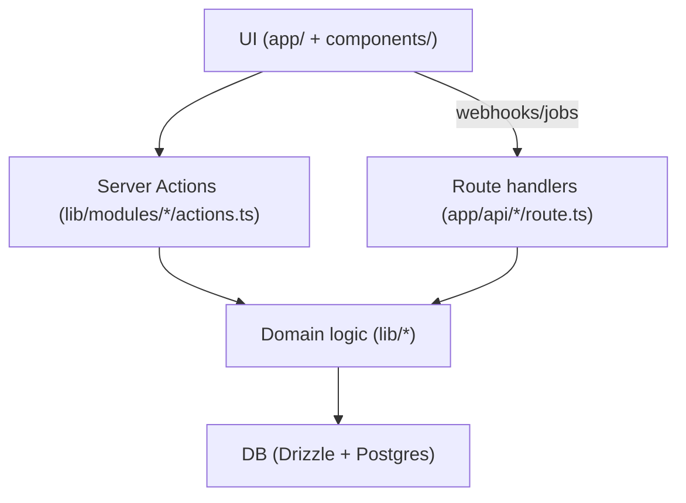

# Turbo Invoice Architecture

## What this repo is

Turbo Invoice is a Next.js App Router app focused on receipt capture, AI extraction, and exports. The codebase is organized around **modules** under `lib/modules/*`, with **Server Actions** as the primary mutation boundary.

## Mental model

## Routing

- **Authenticated app**: `app/(app)/app/*` (route group keeps URLs as `/app/...`).
- **Public routes**: `app/(public)/*` (and `/`).
- **API route handlers** (only when required):
  - `app/api/inngest/route.ts`
  - `app/api/plaid/webhook/route.ts`
  - `app/api/stripe/webhook/route.ts`
  - `app/api/uploadthing/route.ts`

## Server Components vs Client Components

- Pages and layouts in `app/` are **Server Components by default**.
- Use `"use client"` only for interactive UI.
- Data reads are typically done in Server Components (or module helpers called by them).
- Mutations should use **Server Actions** instead of adding new `app/api/*` routes.

## Server Actions: the mutation boundary

Server Actions live in module folders (for example `lib/modules/transactions/actions.ts`) and are the preferred way to:

- validate input (Zod),
- enforce auth (Clerk),
- write to the database (Drizzle),
- return structured results `{ success: boolean, error?: string }`.

## Library layer (`lib/*`)

`lib/*` holds reusable implementation code: domain helpers, DB queries, integrations, and module composition. It is not a request boundary by itself; it’s called from Server Actions, Server Components, and route handlers as appropriate.

## Auth & data scoping (Clerk)

- Server-side auth uses `auth()` from `@clerk/nextjs/server`.
- Every DB query must be scoped by `userId` (multi-tenant safety).

## Feature gating (modules)

There are two layers:

- **Coarse routing/auth**: `proxy.ts` (Next middleware entrypoint).
- **Per-module gating**: module `layout.tsx` (e.g. budgets/import) calling `hasModuleAccess()` from `lib/modules/feature-gate.ts`.

## Tests (Vitest)

- Module-aligned tests live in `tests/modules/<domain>/*`.
- Cross-cutting tests stay in `tests/lib/*`.
- See `tests/README.md` for how to run tests and mocking conventions.
